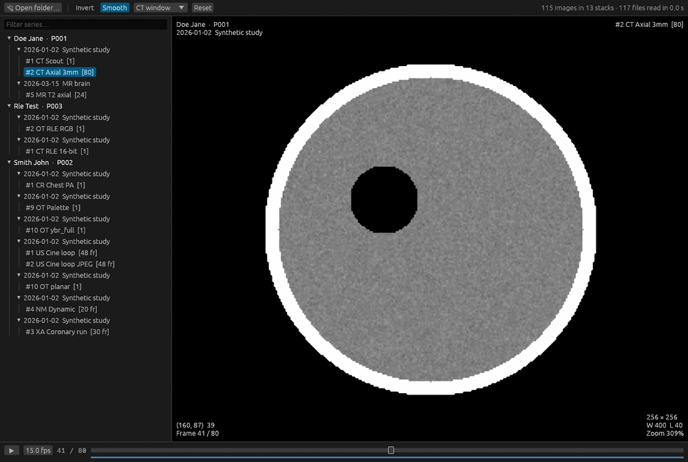

# Quick DICOM

A small, fast DICOM viewer written in Rust. Point it at a folder and it finds
every DICOM file underneath, groups them by patient, study and series, and lets
you scrub through each series or cine loop.



## What it does

- Opens a folder, or a folder of folders, and lists images while it scans.
  It reads only the headers at this stage, on every CPU core.
- Scrubs through slices and multi-frame loops with the mouse wheel, the arrow
  keys or the slider. Plays loops at the frame rate stored in the file.
- Does window/level, inversion, zoom, pan and filtering on the GPU, through
  wgpu (Vulkan, Metal, DirectX 12 or OpenGL). Dragging the window is instant.
- Decodes frames in the background, nearest first, and keeps up to 2 GB of
  them in memory, so scrubbing a series is smooth once it has loaded.
- Reads uncompressed, RLE, JPEG baseline and lossless, JPEG 2000 and deflated
  files, in greyscale, RGB, YBR and palette colour.

## Get it

Every push to GitHub builds Linux, Windows and macOS binaries. Download them
from the artifacts of the latest run on the **Actions** tab.

To build from source, install Rust from <https://rustup.rs>, then run:

```sh
cargo build --release
```

The program is `target/release/quick_dicom` (`quick_dicom.exe` on Windows).
The build also compiles OpenJPEG from C source, using the C compiler that Rust
already needs: the MSVC Build Tools on Windows, the Xcode command line tools on
macOS, and gcc or clang on Linux. No other system packages are needed to build.

On Linux the program needs the usual desktop libraries at run time (X11 or
Wayland, and libxkbcommon) and a Vulkan or OpenGL driver.

The macOS binary is not signed. The first time, right-click it and choose
**Open**, or run `xattr -d com.apple.quarantine quick_dicom`.

## Use it

```sh
quick_dicom                 # then click "Open folder…" or drop a folder on the window
quick_dicom /path/to/scans  # open a folder
quick_dicom image.dcm       # open the file's folder and select that image
```

| To                      | Mouse                                   | Keys                     |
|-------------------------|-----------------------------------------|--------------------------|
| Step through frames     | Wheel, or drag the slider               | ← → or ↑ ↓               |
| Go to first or last     |                                         | Home, End                |
| Change series           | Click it in the list                    | Page Up, Page Down       |
| Play or pause a loop    | ▶ button                                | Space                    |
| Change window and level | Left-drag: right widens, down darkens   | 1–5 for CT presets       |
| Pan                     | Right-drag, middle-drag or Shift+drag   |                          |
| Zoom                    | Ctrl+wheel, or pinch on a trackpad      | F fits the image         |
| Invert                  |                                         | I                        |
| Smooth or sharp pixels  |                                         | S                        |
| Reset the view          | Double-click                            | R                        |
| Open a folder           |                                         | Ctrl+O (Cmd+O on macOS)  |

The CT presets are 1 soft tissue, 2 lung, 3 bone, 4 brain and 5 liver.

The corners of the image show the patient, study, series, frame number, image
size, window, zoom and the value under the pointer.

### Check a folder from the command line

```sh
quick_dicom --check /path/to/scans
```

This scans the folder, decodes every frame, and prints one line per series
with its size, its decode time and the first error, if any. Use it to find
files the viewer cannot read.

### Memory

The frame cache defaults to 2 GB. Set `QUICK_DICOM_CACHE_MB` to change it, for
example `QUICK_DICOM_CACHE_MB=8000 quick_dicom /scans`.

## Limits

- It is a quick-look tool, not a diagnostic workstation.
- JPEG-LS and JPEG XL files show an error rather than an image.
- There are no measurements, annotations or reformats. Overlays and
  presentation states are ignored.
- Windowing is linear. VOI LUT tables and sigmoid functions are ignored.

## How it works

| File               | Job                                                                                                                                                          |
|--------------------|--------------------------------------------------------------------------------------------------------------------------------------------------------------|
| `src/scan.rs`      | Walks the folder tree in parallel, reads each header up to the pixel data, and groups files into stacks: one per series, or one per multi-frame file.        |
| `src/loader.rs`    | Worker threads decode the frames the view asks for, nearest first, into a cache bounded by memory. Multi-frame files stay open between frames.               |
| `src/decode.rs`    | Reads uncompressed and RLE pixel data directly, so one frame of a large file costs one frame. Other codecs go through `dicom-pixeldata`.                     |
| `src/render.rs`    | Uploads each frame to the GPU as 32-bit floats, or RGBA for colour, and draws it inside the egui window.                                                     |
| `src/image.wgsl`   | Applies window, level and inversion, and filters the image: bilinear when zoomed in, several samples per pixel when zoomed out.                              |
| `src/app.rs`       | The window: series list, image view, keyboard and mouse handling, playback.                                                                                  |
