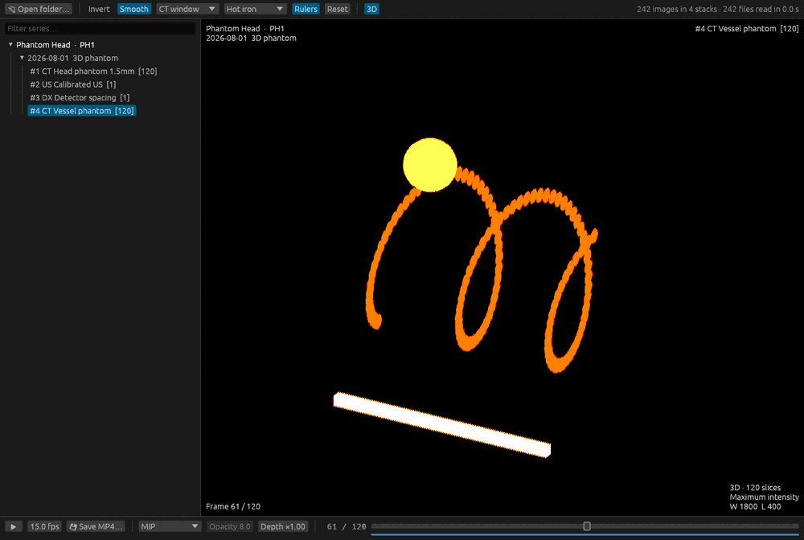

# Quick DICOM

A small, fast DICOM viewer written in Rust. Point it at a folder and it finds
every DICOM file underneath, groups them by patient, study and series, and lets
you scrub through each series or cine loop.


## What it does

- Opens a folder, or a folder of folders, and lists images while it scans.
  It reads only the headers at this stage, on every CPU core.
- Scrubs through slices and multi-frame loops with the mouse wheel, the arrow
  keys or the slider. Plays loops at the frame rate stored in the file.
- Does window/level, inversion, zoom, pan and filtering on the GPU, through
  wgpu (Vulkan, Metal, DirectX 12 or OpenGL). Dragging the window is instant.
- Decodes frames in the background, nearest first, and keeps up to 2 GB of
  them in memory, so scrubbing a series is smooth once it has loaded.
- Reads uncompressed, RLE, JPEG baseline and lossless, JPEG 2000 and deflated
  files, in greyscale, RGB, YBR and palette colour.
- Saves any series or loop as an MP4 video, drawn as you see it on screen.
- Shows millimetre rulers when the file gives a pixel size.
- Colours greyscale images with hot-iron or rainbow maps.
- Turns a series into a 3D stack of slices, with dark parts see-through, or
  a maximum intensity projection.

## Get it

Every push to GitHub builds Linux, Windows and macOS binaries. Download them
from the artifacts of the latest run on the **Actions** tab.

To build from source, install Rust from <https://rustup.rs>, then run:

```sh
cargo build --release
```

The program is `target/release/quick_dicom` (`quick_dicom.exe` on Windows).
The build also compiles two codecs from source: OpenJPEG (C) for JPEG 2000 and
OpenH264 (C++) for video. They need a C and C++ compiler: the MSVC Build Tools
on Windows, the Xcode command line tools on macOS, and gcc and g++ (Debian and
Ubuntu's `build-essential`) or clang on Linux. No other system packages are
needed to build.

On Linux the program needs the usual desktop libraries at run time (X11 or
Wayland, and libxkbcommon) and a Vulkan or OpenGL driver.

The macOS binary is not signed. The first time, right-click it and choose
**Open**, or run `xattr -d com.apple.quarantine quick_dicom`.

## Use it

```sh
quick_dicom                 # then click "Open folder…" or drop a folder on the window
quick_dicom /path/to/scans  # open a folder
quick_dicom image.dcm       # open the file's folder and select that image
```

| To                      | Mouse                                   | Keys                     |
|-------------------------|-----------------------------------------|--------------------------|
| Step through frames     | Wheel, or drag the slider               | ← → or ↑ ↓               |
| Go to first or last     |                                         | Home, End                |
| Change series           | Click it in the list                    | Page Up, Page Down       |
| Play or pause a loop    | ▶ button                                | Space                    |
| Change window and level | Left-drag: right widens, down darkens   | 1–5 for CT presets       |
| Pan                     | Right-drag, middle-drag or Shift+drag   |                          |
| Zoom                    | Ctrl+wheel, or pinch on a trackpad      | F fits the image         |
| Invert                  |                                         | I                        |
| Smooth or sharp pixels  |                                         | S                        |
| Reset the view          | Double-click                            | R                        |
| Open a folder           |                                         | Ctrl+O (Cmd+O on macOS)  |
| Save the series as MP4  | 💾 Save MP4… button                     | Ctrl+S (Cmd+S on macOS)  |
| Change the colour map   | Colour menu in the toolbar              | C                        |
| Show or hide rulers     | Rulers button                           | M                        |
| Switch 3D on or off     | 3D button                               | D                        |

The CT presets are 1 soft tissue, 2 lung, 3 bone, 4 brain and 5 liver.

The corners of the image show the patient, study, series, frame number, image
size, pixel size, window, zoom and the value under the pointer.

### Rulers

Rulers along the bottom and right edges show millimetres at the current zoom.
They appear when the file gives a pixel size: Pixel Spacing for CT, MR and
most other images, the calibrated region for ultrasound, or Imager Pixel
Spacing for radiographs. That last is measured at the detector, where the
X-ray beam has spread, so anatomy measures a few per cent larger than it is;
the ruler says "at detector" when this is so.

### Colour maps

Colour maps replace grey with colour, after the window has been applied, so
small differences in brightness become differences in hue:

- **Hot iron** runs black, red, yellow, white. Nuclear medicine and PET use
  it to show where a tracer has gathered.
- **Rainbow** runs black, purple, blue, green, yellow, red, white. It is used
  for nuclear medicine, perfusion and other parametric maps.

Colour images, such as ultrasound Doppler, keep their own colours.

### 3D



**3D** (or D) turns the series into a stack of its slices. The current slice
tilts back and the others fan out behind it, spaced as the scanner recorded
them. Dark parts are see-through and bright parts solid, so the window
decides what you see: the bone window (3) shows the skeleton, the lung window
(2) the lungs.

| To                      | Mouse                                   |
|-------------------------|-----------------------------------------|
| Turn the stack          | Left-drag                               |
| Change window and level | Ctrl+drag (Cmd+drag on macOS)           |
| Pan                     | Right-drag, middle-drag or Shift+drag   |
| Zoom                    | Wheel, or pinch on a trackpad           |
| Reset the angle         | Double-click                            |

The bottom bar holds the 3D settings:

- **Blend** or **MIP**. MIP, maximum intensity projection, shows the
  brightest value along each line of sight. It is the usual way to show
  contrast-filled vessels in CT and MR angiography, and hot spots in PET.
- **Opacity** sets how quickly bright parts block the view.
- **Depth** stretches or squashes the gap between slices. Without slice
  positions in the files, as in a cine loop, the stack is made half as deep
  as it is wide.

Series of more than 256 slices use every second (or third…) slice, and
slices wider than 512 pixels are averaged down, so the stack fits on the GPU.

### Save a video

**Save MP4…** writes the current series or loop as an H.264 MP4, which plays
in browsers, PowerPoint, Keynote, QuickTime and VLC. The video:

- runs through every frame, at the rate in the fps box;
- uses the current window, level, inversion and smoothing, but not the zoom
  or pan, so it always shows the whole image;
- uses the current colour map;
- leaves out the overlay text and rulers, so no patient details end up in
  the file;
- scales small images up by a whole number, so the longer side is at least
  512 pixels, and large ones down, so it is at most 2048.

A progress bar replaces the button while the video is written, and **Cancel**
stops it without leaving a file. Frames that cannot be decoded come out black,
and the status line says how many there were.

### Check a folder from the command line

```sh
quick_dicom --check /path/to/scans
```

This scans the folder, decodes every frame, and prints one line per series
with its size, its decode time and the first error, if any. Use it to find
files the viewer cannot read.

### Memory

The frame cache defaults to 2 GB. Set `QUICK_DICOM_CACHE_MB` to change it, for
example `QUICK_DICOM_CACHE_MB=8000 quick_dicom /scans`.

## Limits

- It is a quick-look tool, not a diagnostic workstation.
- JPEG-LS and JPEG XL files show an error rather than an image.
- There are no measurements, annotations or reformats. Overlays and
  presentation states are ignored.
- Windowing is linear. VOI LUT tables and sigmoid functions are ignored.
- Videos are H.264, encoded with OpenH264 built from source. Cisco pays the
  H.264 patent royalties only for the OpenH264 binaries it distributes itself,
  so that cover does not extend to these builds. This rarely matters for
  personal use; check before you distribute builds.
- The 3D view is a stack of slices, not a reconstruction: seen almost edge-on,
  the gaps between slices show. Videos always show the 2D slices.

## How it works

| File               | Job                                                                                                                                                          |
|--------------------|--------------------------------------------------------------------------------------------------------------------------------------------------------------|
| `src/scan.rs`      | Walks the folder tree in parallel, reads each header up to the pixel data, and groups files into stacks: one per series, or one per multi-frame file.        |
| `src/loader.rs`    | Worker threads decode the frames the view asks for, nearest first, into a cache bounded by memory. Multi-frame files stay open between frames.               |
| `src/decode.rs`    | Reads uncompressed and RLE pixel data directly, so one frame of a large file costs one frame. Other codecs go through `dicom-pixeldata`.                     |
| `src/render.rs`    | Uploads each frame to the GPU as 32-bit floats, or RGBA for colour, and draws it inside the egui window.                                                     |
| `src/image.wgsl`   | Applies window, level and inversion, and filters the image: bilinear when zoomed in, several samples per pixel when zoomed out.                              |
| `src/export.rs`    | Draws each frame with the current window into YUV, as the shader would, and encodes it with OpenH264 on a background thread.                                |
| `src/mp4.rs`       | Writes the H.264 frames into an MP4 file, with the index before the data so playback can start before the file has loaded.                                   |
| `src/volume.rs`    | Builds the 3D volume in the background: decodes every slice, keeps raw values as 16-bit floats, and works out the gap between slices from their positions.  |
| `src/render3d.rs`  | Draws the slices far to near into an offscreen image, blending them or keeping the maximum, then puts that image on screen.                                  |
| `src/volume.wgsl`  | The 3D shaders: places each slice, applies window and colour map, and makes dark parts clear and bright parts solid.                                        |
| `src/colormap.rs`  | The colour maps, with twins in `src/common.wgsl` for the GPU.                                                                                               |
| `src/app.rs`       | The window: series list, image view, keyboard and mouse handling, playback.                                                                                  |
